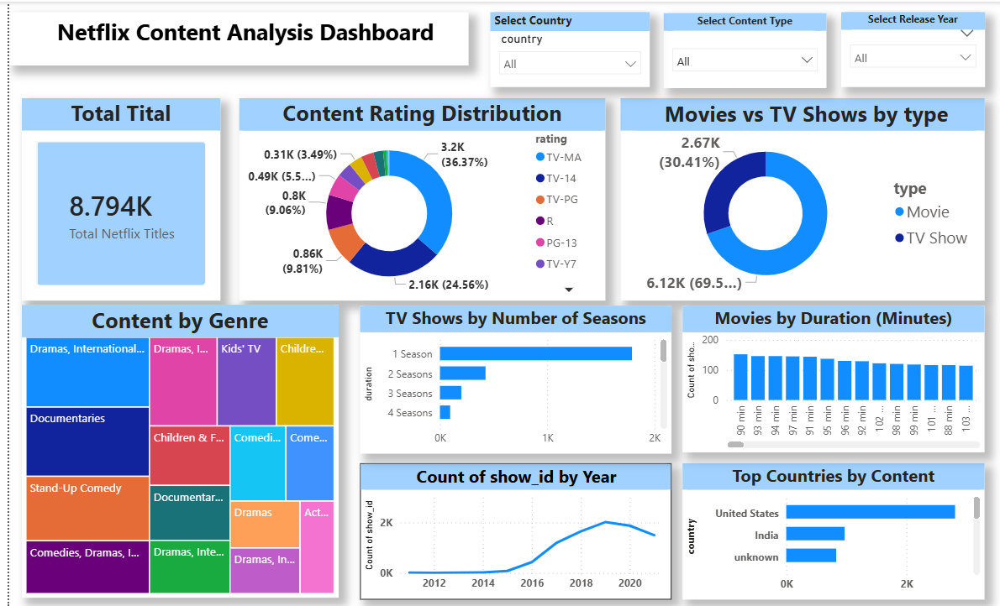

# 🎬 Netflix Content Analysis Dashboard

An end-to-end data analytics project that explores Netflix's content library using **Excel, SQL, and Power BI**. The project covers the complete workflow — from raw data collection to a fully interactive Power BI dashboard.



---

## 📌 Project Overview

This project analyzes Netflix's Movies and TV Shows dataset to uncover trends related to content type, ratings, genres, release years, and countries of production. The final output is an interactive Power BI dashboard that allows users to filter and explore Netflix's content catalog dynamically.

---

## 🗂️ Dataset

- **Source:** [Kaggle](https://www.kaggle.com/) — Netflix Movies and TV Shows dataset
- **Total Records:** ~8,794 titles
- **Key Columns:**
  - `show_id` – Unique identifier for each title
  - `type` – Movie or TV Show
  - `title` – Name of the content
  - `director` – Director of the content
  - `country` – Country of production
  - `date_added` – Date the title was added to Netflix
  - `release_year` – Year the content was originally released
  - `rating` – Content rating (TV-MA, TV-14, PG-13, R, etc.)
  - `duration` – Duration in minutes (Movies) or number of seasons (TV Shows)
  - `listed_in` – Genre(s) of the content

---

## 🛠️ Tools & Technologies Used

| Stage | Tool Used |
|-------|-----------|
| Data Collection | Kaggle |
| Data Cleaning | Microsoft Excel |
| Data Exploration & Analysis | SQL |
| Data Visualization / Dashboard | Power BI |

---

## 🔄 Project Workflow

1. **Data Collection** – Downloaded the raw Netflix dataset from Kaggle.
2. **Data Cleaning (Excel)** – Handled missing values (e.g., unknown countries/directors), removed duplicates, standardized date formats, and fixed inconsistent entries.
3. **Data Analysis (SQL)** – Wrote SQL queries to explore the cleaned data, such as counting titles by type, year, rating, and country, to validate patterns before visualization.
4. **Dashboard Design (Power BI)** – Imported the cleaned dataset into Power BI and built an interactive dashboard with slicers, donut charts, bar charts, treemaps, and line charts.

---

## 📊 Dashboard Features

The Power BI dashboard includes the following visuals:

- **Total Titles Card** – Displays the total count of Netflix titles (8.794K)
- **Content Rating Distribution** – Donut chart showing the split across TV-MA, TV-14, TV-PG, R, PG-13, TV-Y7, and other ratings
- **Movies vs TV Shows** – Donut chart comparing the proportion of Movies (69.5%) vs TV Shows (30.4%)
- **Content by Genre** – Treemap visualizing the most common genres (Dramas, Documentaries, Stand-Up Comedy, Kids' TV, etc.)
- **TV Shows by Number of Seasons** – Bar chart showing how many shows have 1, 2, 3, or 4+ seasons
- **Movies by Duration (Minutes)** – Bar chart showing the distribution of movie runtimes
- **Count of show_id by Year** – Line chart showing content growth on Netflix over the years (2012–2020+)
- **Top Countries by Content** – Bar chart highlighting the top content-producing countries (United States, India, etc.)

### 🔍 Interactive Filters (Slicers)
- Select Country
- Select Content Type (Movie / TV Show)
- Select Release Year

---

## 📈 Key Insights

- Movies make up nearly **70%** of Netflix's content library, while TV Shows account for **30%**.
- **TV-MA** is the most common content rating, making up over **36%** of all titles.
- Content addition on Netflix grew rapidly between **2016 and 2019**, before slightly declining after 2020.
- The **United States** and **India** are the top two contributors of content on the platform.
- **Dramas** and **Documentaries** are among the most frequent genres.

---

## 🚀 How to Use

1. Clone this repository:
   ```bash
   git clone https://github.com/your-username/netflix-content-analysis-dashboard.git
   ```
2. Open the `.pbix` file in **Power BI Desktop**.
3. Use the slicers at the top to filter by Country, Content Type, or Release Year and explore the visuals.

---

## 📁 Repository Structure

```
netflix-content-analysis-dashboard/
│
├── data/                # Raw and cleaned dataset (CSV/Excel)
├── dashboard/            # Power BI (.pbix) file
├── images/               # Dashboard screenshots
└── README.md
```

---

## 🙋‍♂️ Author

Feel free to connect or reach out if you have any feedback or suggestions!

---

⭐ If you found this project helpful, consider giving it a star on GitHub!
